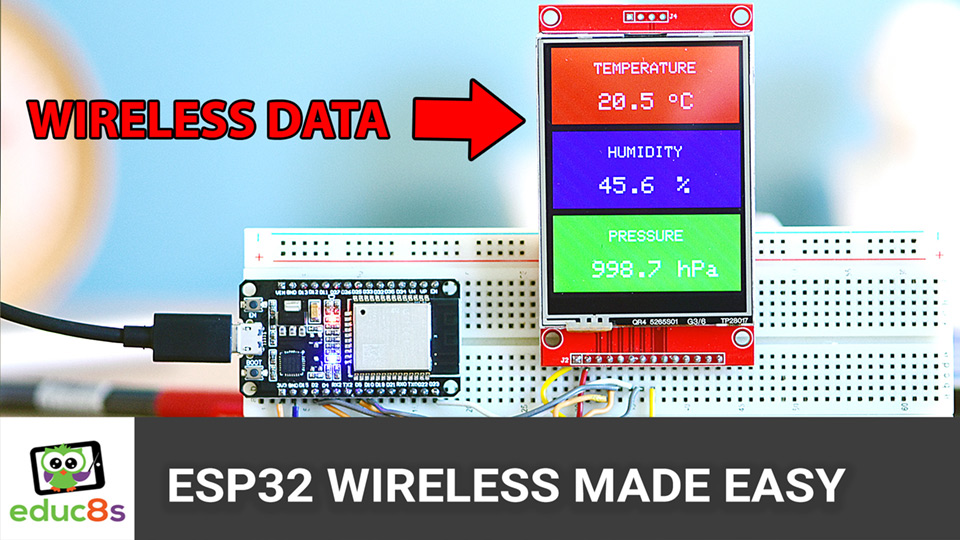

# ESP32 ESP-NOW Wireless Weather Station

## Overview
This project demonstrates the power of ESP-NOW wireless protocol using ESP32 microcontrollers. Unlike traditional wireless communication methods (NRF, Bluetooth, 433MHz, WiFi), ESP-NOW offers a simpler, more reliable, and energy-efficient way to connect ESP devices. The project creates a wireless weather station that transmits real-time temperature, humidity, and pressure data from a BME280 sensor to a receiver ESP32 connected to a 2.8" ILI9341 display.

The project includes both basic ESP-NOW communication examples and a complete weather station implementation, all using a custom ESPNowEasy wrapper class that simplifies the wireless communication process.

## Repository Structure
The repository contains two main folders:
1. **Basic Example** - Simple sender and receiver code to demonstrate ESP-NOW communication fundamentals
2. **Weather Station** - Complete implementation of the wireless weather station with sensor integration and display

## Features
- **ESP-NOW Protocol:** Lightweight, connectionless wireless communication built directly into ESP32
- **Broadcasting Mode:** Send data to any listening ESP32 without complex pairing
- **Low Power Consumption:** Ideal for battery-powered applications
- **Real-Time Sensor Data:** Stream temperature, humidity, and barometric pressure readings
- **Custom ESPNowEasy Wrapper:** Simplifies ESP-NOW usage with just a few lines of code
- **Cross-Device Compatibility:** Works between different ESP32 models (tested with ESP32 and ESP32-S3)
- **Reliable Range:** Consistent connectivity throughout a typical home environment

## Video Tutorial

🎥 [Watch the Full Video Tutorial](https://youtu.be/WQLXYT9Z1BI)

## Parts List
Here are the components you need for this build:

| Component | Description | Buy Link |
|-----------|-------------|---------|
| **ESP32** | Transmitter microcontroller | [Buy Here](https://educ8s.tv/part/ESP32) |
| **ESP32S3** | Receiver microcontroller (optional, regular ESP32 also works) | [Buy Here](https://educ8s.tv/part/ESP32S3) |
| **BME280** | Sensor for temperature, humidity, and barometric pressure | [Buy Here](https://educ8s.tv/part/BME280) |
| **2.8" ILI9341 Display** | Screen for displaying sensor readings | [Buy Here](https://educ8s.tv/part/28ILI9341) |

## Project Structure
The repository includes two main examples:
1. **Basic ESP-NOW Communication:**
   - Simple sender that broadcasts a counter and "Hello World" message
   - Receiver that displays the incoming data on the Serial Monitor

2. **Wireless Weather Station:**
   - Transmitter with BME280 sensor
   - Receiver with 2.8" ILI9341 display showing real-time weather data

## Software Components
The project uses a custom wrapper for ESP-NOW:
- **`ESPNowEasy.h` & `ESPNowEasy.cpp`** – Custom wrapper class that simplifies ESP-NOW communication
- **Transmitter Sketches** – For both basic example and weather station
- **Receiver Sketches** – For both basic example and weather station display

## How to Use
1. Download and include the ESPNowEasy files in your Arduino project
2. Define your data structure (what you want to send)
3. Create an ESPNowEasy object with your data structure
4. Initialize with `espNow.begin()`
5. Send data with `espNow.send(data)`
6. For receivers, set up a callback function with `espNow.onReceive()`

## Future Improvements
- **Extended Range Testing:** Exploring ESP-NOW's 400m theoretical range capability
- **Advanced Weather Station:** Upcoming project with additional features and sensors

## License & Open Source Contribution
This project is fully open source, and contributions are welcome! Feel free to expand the functionality and share your modifications.

🛠 Built by [Nick Koumaris](https://www.educ8s.tv)
📺 Follow me on [YouTube](https://www.youtube.com/educ8s) for more projects!
